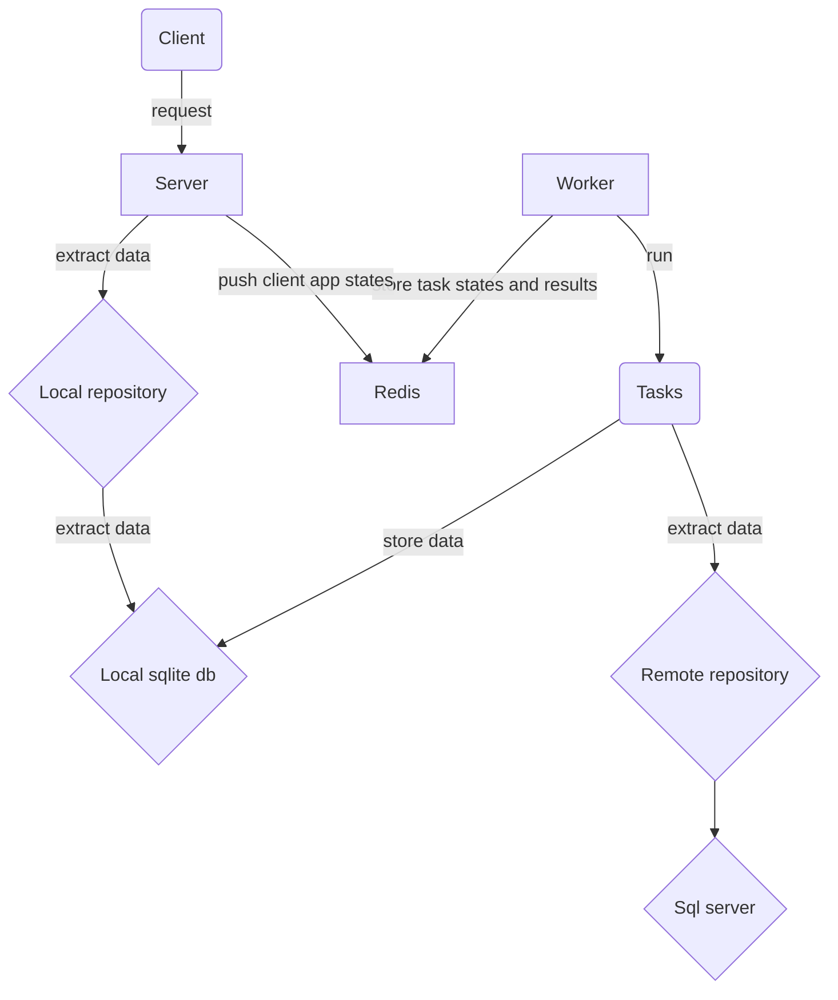

# How to run the app
Add **.env** file containing the following env vars:
- SQL_SERVER=...
- SQL_DATABASE=DXStatisticsV2
- SQL_USER=...
- SQL_PASSWORD=...
- REDIS_PORT=6379
- REDIS_DB=COST_METRICS
- DB_HOME=/root/app/data
- WF_LOGIN_HEADER=AuthLogin
- WF_LOGIN_PASSWORD=AuthPassword
- WF_LOGIN=...
- WF_PASSWORD=...
- WF_ENDPOINT=https://int.devexpress.com/wf/data/GetDayAppointmentAnalysis
- EMPS_ENDPOINT=https://hr-employee.devexpress.devx/api/v1/employees?expandDetails=True&expandDataForAnalytics=True&type=ActiveOrRetired&IncludeServiceUsers=True
- EMPS_AUDIT_ENDPOINT=https://hr-employee.devexpress.devx/api/v1/audit-employees
- EMPS_VACATIONS_ENDPOINT=https://int.devexpress.com/employees/api/v1/vacations/getVacations
- EMPS_POSITIONS_ENDPOINT=https://hr-employee.hosting.devexpress.com/api/v1/employeePositions
- EMPS_LOCATIONS_ENDPOINT=https://hr-employee.hosting.devexpress.com/api/v1/employeeLocations
- EMPS_LEVELS_ENDPOINT=https://hr-employee.hosting.devexpress.com/api/v1/employeeLevels
- EMPS_APPID=...
- EMPS_USERID=...
- EMPS_APIKEY=...
- AUTH_ENDPOINT=https://graph.microsoft.com/v1.0/me
- AUTH_ENABLED=1
- CORS_ORIGINS=["https://ubuntu-support.corp.devexpress.com","http://localhost:3000"]
- ADMIN_ROLE=Admin
- ADVANCED_ROLE=Advanced
- PRODUCTION=1 #0 = false, 1 = true
- UPDATE_ON_STARTUP=0 #0 = false, 1 = true
- RECALCULATE_FROM_THE_BEGINNING=0
- RECALCULATE_FOR_LAST_MONTHS=1 # 0 = current, 1 = previous month, 2 = last two months etc. We run calculation every first day of each months for last month. See config:get_schedule and config:offset_in_months for details. So, RECALCULATE_FOR_LAST_MONTHS should be 1 or greater.

Make sure:
<b>support_analytics</b> network is created:  **docker network create -d bridge support_analytics**

Then run <b>docker-compose up</b>.

## To run locally
Pull git submodules (**git submodule foreach git pull origin main**). 

Then either 
- Run <b>docker compose build</b> and <b>docker compose up</b>. 
VERSION env var specifies prefix which allows running same container on same machine - just add VERSION to your .env if required and run another version of same containers alongside already running.
 

--OR-- 

 - Create virtual env using [poetry](https://python-poetry.org/docs/#installation). For this run poetry "env use /path/to/python". You can install python from source or download it from a repository. 
 - Install dependencies ("poetry install")
 - Execute ". .dev_env.sh" to export dev env vars
 - start redise_service **docker run -d --name=redis_service -v redis_stack:/data --network=support_analytics --restart always redis/redis-stack:latest** 
 - Run .venv/bin/uvicorn server:app --host 0.0.0.0 --port $SERVER_PORT --reload --log-level=info

## To run on production
Copy docker-compose.yaml and .env to the target machine and run "docker compose up".

# How it works

# App components

## config
Stores period and other possible configuration settings. 

## sql_queries
Stores
- raw sql queries that are run by query executors via repository (see repository's _init_).
- sql query's meta data which sores column names, index columns and other information about underlying tables.
- index and tables definitions used to create local tables.

All queries are separated into three categories:
- remote - used to extracts data.
- transform_load - used to transform extracted data: create new tebles etc.
- local - used to extract data for the client request.

## repository
Tasks and other components access data via repositories only which have direct access to data bases. Repositories are split into categories according to their purpose: local accesses only local db, remote accesses only remote db, wf acesses workflow's data. 
All repositories contain corresponding query descriptors which are used by query executors to extract data from dbs. 
Repositories can be sync or async. Async repositories are used by the server, while sync are used by tasks. 
The reason is worker runs their tasks in a process pool in specific sequence. Having async repos not only won't give any benefits, but also may slow calculations. 
Having async repositories on the server side will give significant benefit in terms of memory and performance because the server is ASGI application. 

## utils
Contains helpers.

# How to push an update
There are two remote preconfigured branches: release and rc (see .github/workflows). 
You create a new local branch, add changes to it, push it to remote and then merge your branch into rc or release (if you are shure you want to update release version directly). Then add VERSION=_rc to the .env file on production machine if you are going to run the release candidate (rc) version or skip it if you want to run release version.
